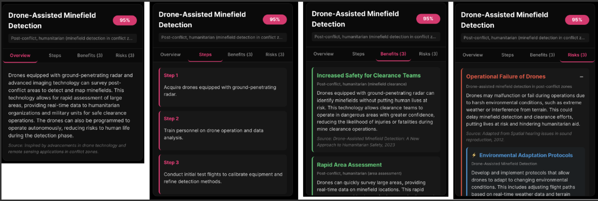

# RebuildAI: Transforming Post-Conflict Recovery with AI-Driven Solutions

[](https://youtu.be/bfkX8oyPAlY)

---

### 💡 **Introduction**

The use of technology for post-conflict recovery is crucial—it offers ways to support human well-being and ensure that innovation **rebuilds lives** rather than causing harm.
However, despite its potential, technology remains **underutilized** in post-conflict contexts due to:

* Disciplinary silos
* Limited integration with past knowledge
* Scattered academic literature
* High barriers for practitioners

---

### 🎯 **Our Contributions**

**1️⃣ Data Processing**
We analyzed **2,000 academic abstracts** and built four structured lists:

* **Post-conflict scenarios** matched with solutions
* **Solution-benefit pairs**
* **Solution-risk pairs**
* **Risk-mitigation strategies**

This information is stored in a **vector database**.

**2️⃣ Intelligent Tool**
We built a tool where users enter a post-conflict scenario and receive **solution cards**:

* Solution overview
* Benefits
* Risks
* Mitigation strategies
* Implementation steps

The system uses a **Retrieval-Augmented Generation (RAG)** pipeline.

**3️⃣ Co-Design Evaluation**
We engaged experts to:

* Select a scenario
* Review generated cards
* Provide qualitative feedback

We then refined the system in **two iterative design cycles**.

---

## 🖥️ System Overview

The **War Use Case Analyzer** is a full-stack application with three components:

| 🧩 **Component**           | ⚙️ **Description**                                 |
| -------------------------- | -------------------------------------------------- |
| 🔧 **Backend API**         | Flask-based REST API with RAG pipeline             |
| 🖥️ **Frontend Interface** | React/TypeScript web app for user interaction      |
| 🗂️ **Data Processing**    | Scripts for preparing and managing vector database |

---

## 🚀 Quick Start

### ⚙️ **Prerequisites**

* Python **3.8+**
* Node.js **16+**
* OpenAI API key
* Pinecone API key and index

---

### 📦 **Installation & Setup**

**Set up each component** by following the detailed instructions in their respective README files:

* 📁 [Backend Setup](./backend/README.md)
* 📁 [Frontend Setup](./frontend/README.md)
* 📁 [Data Processing Setup](./datapreprocessing/README.md)

**Start the system:**

```bash
# Terminal 1 - Backend
cd backend
python main.py

# Terminal 2 - Frontend
cd frontend
npm run dev
```

---

### 🌐 **Expected Outputs**

**User Workflow:**

1️⃣ Enter the **post-conflict scenario**
2️⃣ Click **"Analyse"**
3️⃣ Receive a set of **decision support cards**

📸 **Main Page:** 

🃏 **Solution Cards:**
Each card includes:

* **Overview**
* **Steps**
* **Benefits**
* **Risks**
* **Mitigations**



---

## 📬 Contact

**Authors:**

* 🧑‍💻 [Luca Dadone](https://github.com/dadoluca)
* 🧑‍💻 [Andrea Bioddo](https://github.com/andreabioddo)
* 🧑‍💻 [Fang Xu](https://github.com/Fang-M-Xu)

---

### 🌟 **Let’s rebuild responsibly!**


