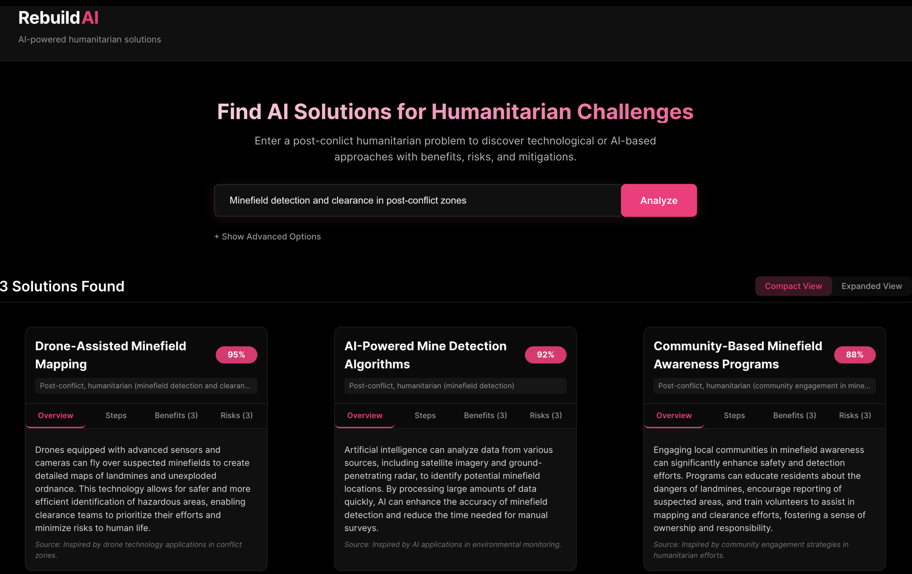

# RebuildAI: Transforming Post-Conflict Recovery with AI-Driven Solutions
The use of technology for post-conflict recovery is very important because it offers a meaningful way to support human well-being and ensure that innovation contributes to rebuilding lives rather than causing harm. However, despite its potential, technology remains underutilized in post-conflict contexts. 
In tackling this problem, related work failed in providing accessible tools that help identify actionable and responsible uses of technology in post-conflict settings. Existing efforts are often limited by disciplinary silos, lack of integration with past knowledge, and the high effort required to navigate scattered academic literature barriers that prevent practitioners from designing informed interventions.
To address these challenges, we make three contributions.
First, we process 2,000 academic abstracts to build four structured lists: post-conflict scenarios with matching solutions, solution-benefit pairs, solution-risk pairs, and risk-mitigation strategies. We store all of this information in a vector database.
Second, we build a tool that lets users enter a post-conflict scenario and receive cards with possible solutions. Each card includes a solution, its benefits, risks, ways to reduce those risks, and clear steps to apply it. The system uses a Retrieval-Augmented Generation (RAG) pipeline.
Third, we use a co-design approach where experts select a scenario and review two cards generated by the tool. They evaluate the cards using qualitative metrics and open-ended questions. We then perform a thematic analysis of their feedback and use it to improve the system through two design cycles.

## System Overview

The War Use Case Analyzer is a full-stack application consisting of three main components:

- **Backend API**: Flask-based REST API with RAG pipeline for use case analysis
- **Frontend Interface**: React/TypeScript web application for user interaction
- **Data Processing**: Tools and scripts for preparing and managing vector database content


## Quick Start

### Prerequisites
- Python 3.8+
- Node.js 16+
- OpenAI API key
- Pinecone API key and index

### Installation & Setup

 **Set up each component**:
   Follow the detailed instructions in each component's README file:
   - [Backend Setup](./backend/README.md)
   - [Frontend Setup](./frontend/README.md)
   - [Data Processing Setup](./datapreprocessing/README.md)

 **Start the system**:
   ```bash
   # Terminal 1 - Backend
   cd backend
   python main.py
   
   # Terminal 2 - Frontend
   cd frontend
   npm run dev
   ```
### Expected outputs 
This the main page after run the program,User input the post-war problem. Click 'Analyse' button,then generate the relative solutions for the problem.


Our platform will give you s set of decision support cards.
- Overview: Describes AI application method and the advantages of its imimplement.
- Steps: Provide brief implementation suggestions.
- Benefits: Detailed descriptions of this AI technology advantages in social, ethical, logistical, or humanitarian improvements.
- Risks: The risks of this solution may cause in terms of ethics, operation, or society dangers.
- Mitigations: Measures to reduce or eliminate above risks.


